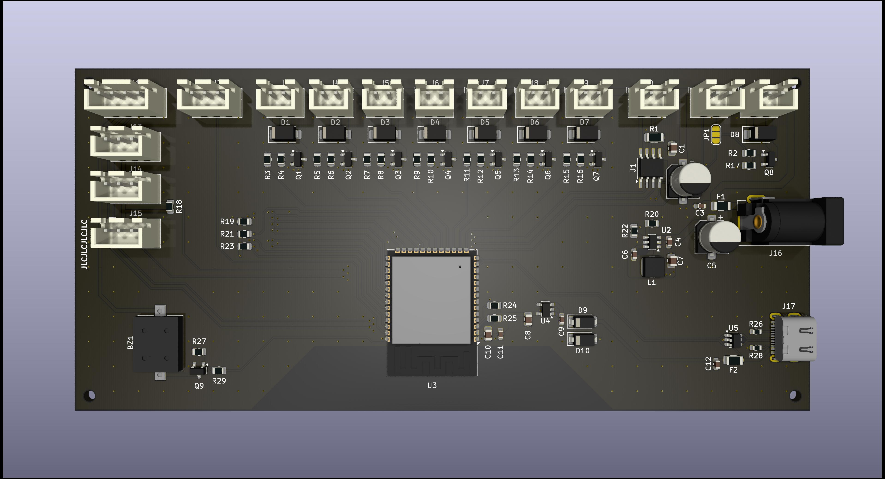
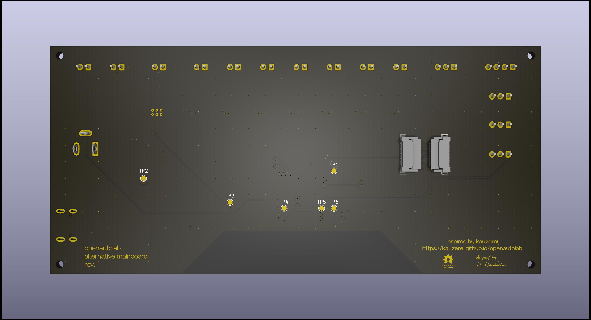

# Alternative mainboard for OpenAutoLab

The [OpenAutoLab](https://github.com/kauzerei/openautolab) is a automatic film processor developed by [@kauzerei](https://github.com/kauzerei).

I've designed an alternative mainboard based on an ESP32-S3 to also support transfer of development processes via BLE (and in future maybe WiFI with web interface).

